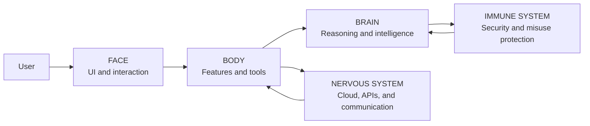

# ZYNEX Autonomous AI

### Intelligence That Acts.

ZYNEX is an AI platform designed to help people understand, analyze, reason, create, solve, and automate work across multiple domains. This repository is a **public product showcase and documentation space**. It intentionally contains no proprietary production source code, customer data, deployment configuration, payment credentials, or private infrastructure details.

> **Website:** [zynexai.co](https://zynexai.co/)

## Product status

| Surface | Current status |
|---|---|
| Web application | Available |
| Android application | Planned; no public store listing is announced in this repository |
| Public source code | Not published; production implementation remains proprietary |

## Current capabilities

ZYNEX currently presents a web workspace for AI chat, programming assistance, code explanation and debugging, document and file analysis, website analysis, research support, mathematics and science assistance, educational support, content drafting, resume assistance, multilingual interaction, user profiles, conversation history, and subscription management.

The platform also provides secure authentication, account-aware experiences, a technical intelligence documentation surface, and productivity-oriented tools. Availability may vary by plan, region, and release stage.

## Roadmap and research direction

ZYNEX is being developed toward more autonomous, tool-aware, and goal-oriented workflows. The following areas are **planned or research-stage**, not represented as production-ready capabilities: autonomous engineering and self-audit, mission/action workflows, AI shopping intelligence, advanced automation, multi-agent collaboration, multi-node or consensus research, and advanced long-term memory.

See [ROADMAP.md](ROADMAP.md) for the public roadmap and [docs/features.md](docs/features.md) for the distinction between current and planned capabilities.

## Conceptual architecture

The diagram is conceptual. It deliberately excludes private endpoints, credentials, infrastructure identifiers, and deployment topology. See [docs/architecture.md](docs/architecture.md).

## Subscription presentation

The public subscription hierarchy is **Free → Plus → Max → Apex → Coming Soon**. Plan availability and benefits can evolve.

| Provider | Public status |
|---|---|
| Razorpay | Available |
| Stripe | Coming Soon |
| Paddle | Coming Soon |
| PayU | Coming Soon |
| Cashfree | Coming Soon |

No payment credentials, merchant identifiers, webhook secrets, or private implementation details are published here.

## Technology overview

ZYNEX currently uses a TypeScript web stack centered on React, Vite, Express, tRPC, Drizzle ORM, a SQL database layer, and OAuth-based authentication. The platform uses AI/LLM infrastructure, file storage, and production monitoring appropriate to its web application. This showcase intentionally documents only high-level technologies; it does not publish private service addresses, environment values, or infrastructure configuration.

## Explore

| Resource | Purpose |
|---|---|
| [Architecture](docs/architecture.md) | Conceptual platform model |
| [Features](docs/features.md) | Current versus planned capabilities |
| [Security](docs/security.md) | Public security posture and reporting guidance |
| [Roadmap](ROADMAP.md) | Direction and planned stages |
| [Getting started](docs/getting-started.md) | Safe contributor orientation |

## Community

If this showcase is useful, consider starring the repository, following project updates through the official website, exploring ZYNEX, and sharing feedback through the product’s published channels. No social-media or community links are included unless they have been officially published.

## Repository safety

Please read [SECURITY.md](SECURITY.md) before reporting a vulnerability and [CONTRIBUTING.md](CONTRIBUTING.md) before proposing documentation improvements. Never commit secrets, credentials, production configuration, private user data, or proprietary source code.

## License

This repository is a public documentation showcase. It is **not** an open-source release of the ZYNEX production application. See [LICENSE](LICENSE).
