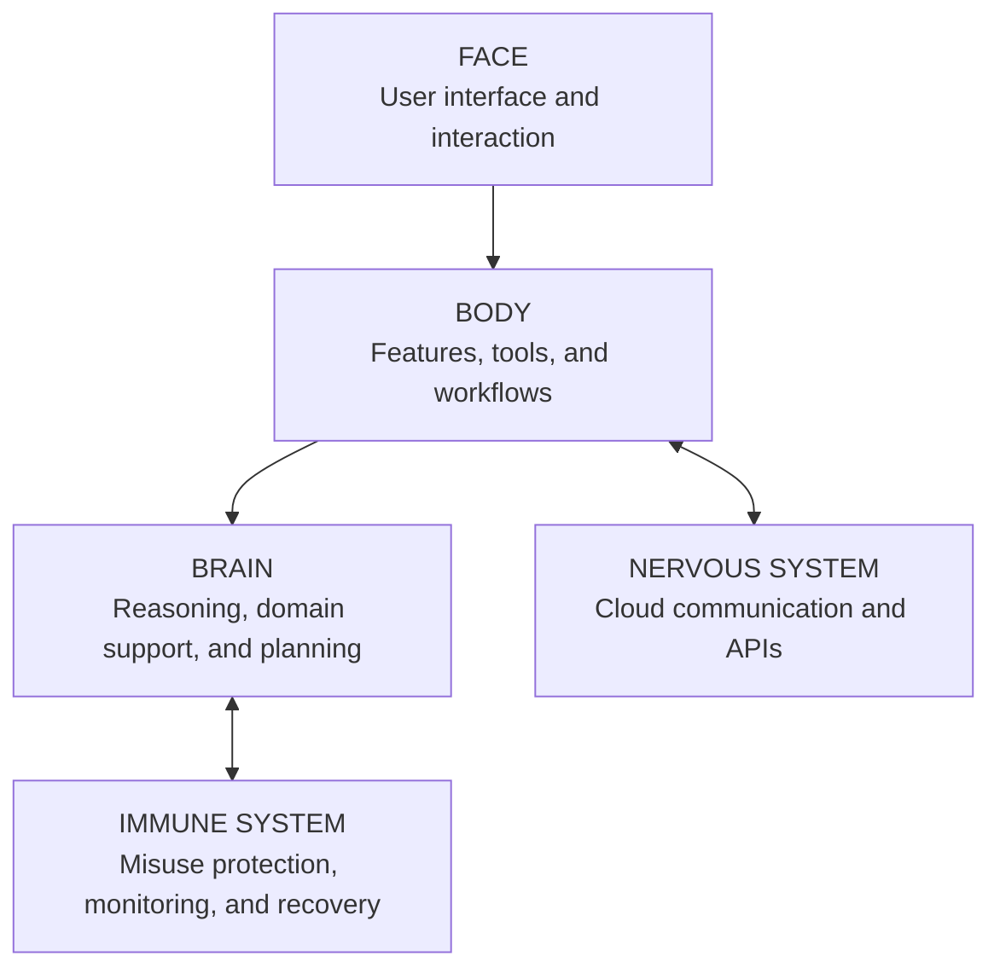

# Conceptual Architecture

ZYNEX uses a conceptual model that separates intelligence, product surfaces, security, communication, and user experience. It is designed to explain the product without revealing private infrastructure.

The **Brain** represents reasoning and domain assistance. The **Body** represents user-facing features and tools. The **Immune System** represents security, misuse protection, monitoring, and recovery. The **Nervous System** represents high-level communication and API coordination. The **Face** represents the product interface and user interaction.

This document intentionally excludes network topology, private endpoints, tenant identifiers, credential flows, database schema, and deployment configuration.
